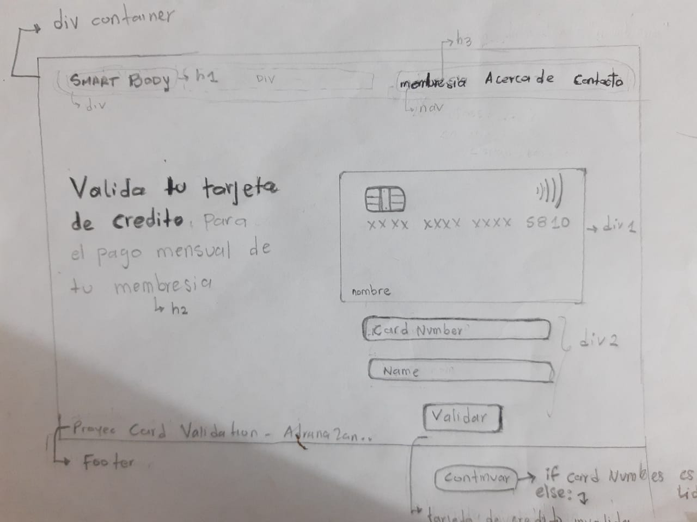

# Body Smart Card Validation 
* El presente proyecto permite validar el numero de una tarjeta de credito 
para que los usuario de un gimnasio pueda realizar sus pagos de membresia mensual 
* Investigación UX:
 1. Los usuarios son  las personas que asisten a un gimnasio y necesitan relizar el pago por medio de sus tarjetas de credito. 
 2. Con esta aplicacion pueden validar o demostrar que estan realizando el pago con una tarjeta de credito valida.
 3. Primer Prototipo 
 
  4. Prototipo final
 
       
